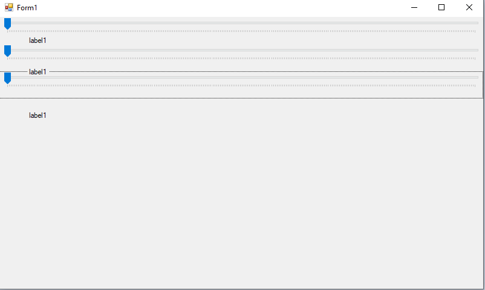
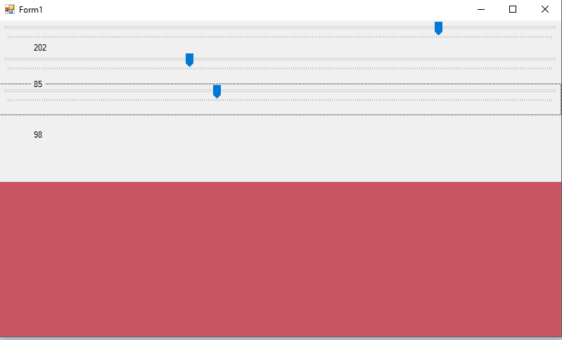

# trackbar-CSharp
teste de trackbar em aula no visual studio com c#. projeto rápido para aprender a usar trackbar.
  

  <h3>A tela com as três trackbars e os labels e ainda uma surpresa embaixo.</h3>
  

  

  <h3>Com as três trackbars é possível mudar a cor do elemento embaixo de acordo com o sitema RGB.</h3>
  

